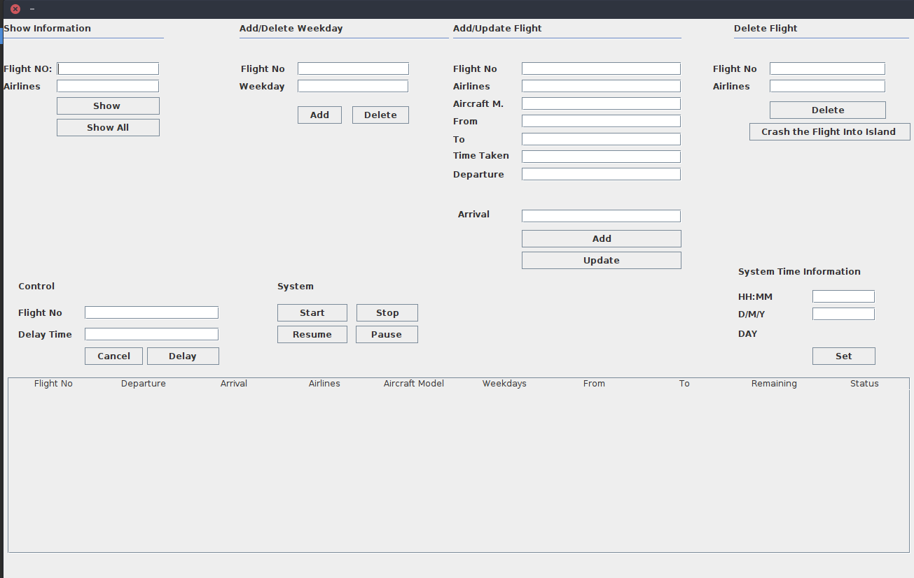

# Flight Tracker Application

## What is?

This is a semester project of Object Oriented Programming BLM2012. This project includes subjects such that GUI, Multithreading, File I/O. Related classes in the ../src file. System attributes is given below.

## System Attributes
- This program simulates theflights between the major capitals, such as New York, Sydney, Paris, Tokyo, Istanbul etc. around the world. 

- System includes at least 10 routes between 5 major capitals from different continents. 

- The user would also add new capitals as well as new destinations to the system.

- In addition to that, the user could delete and update existing destinations via the GUI. 

- The user can declare the flight details, such as the weekdays, the departure and arrival times, the aircraft model, the flight number and the name of the airlines. 

- All the information is saved into the related files.

- System have a system date, and one second in your system would represent one minute in the real life. User is able to start, pause, resume and stop the time of the system. The scheduled flights would be simulated regarding to the system time.

- Each capital has a control tower to manage take offs and landings. For example, the tower manager would set some delay for a scheduled flight or she/he could cancel certain flights or even make the aircrafts, which are close to the related tower, wait in the air.

- SYSTEM ALSO HAS "CRASH THE FLIGHT INTO ISLAND" OPTION!

## Panel

 <!-- .element height="20%" width="20%" -->
